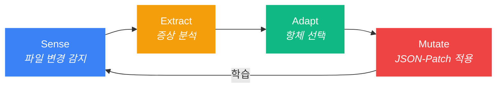

<p align="center">
  
</p>

<h3 align="center">AI 에이전트를 위한 투명한 수호자</h3>
<p align="center"><strong>자가 치유 환경 + 토큰 94% 절감. AI가 파일을 날려먹어도 184ms 안에 원상복구.</strong></p>

<p align="center">
  <a href="https://github.com/dotoricode/autonomous-flow-daemon">
    
  </a>
</p>

<p align="center">
  
  <a href="https://www.npmjs.com/package/autonomous-flow-daemon"></a>
  
  
  
</p>

<p align="center">
  <a href="README.md">English</a>
</p>

---

## 숫자가 증명한다

| 상황 | afd 없이 | afd 있으면 |
|:-----|:---------|:----------|
| AI가 `.claudeignore` 삭제 | **30분** 수동 복구 | **0.2초** 자동 치유 |
| Hook 파일 오염 | 훅 재주입, 세션 재시작 | **백그라운드 무음 수리** |
| `git checkout`으로 이벤트 50개 폭발 | AI 폭주 시작 | **폭주 억제기 즉시 개입** |
| 대용량 파일 8개 읽기 (114KB) | **~28,600 토큰** 소비 | **~1,700 토큰** (94% 절약) |
| 세션 토큰 예산 | 컨텍스트 윈도우 순삭 | **배치당 26,900 토큰 절약** |

> `CPU 0.1% 미만` | `RAM ~40MB` | `전체 치유 사이클 270ms` | 있는지도 모르게 동작한다.

---

## 명령어 하나로 끝

```bash
npx @dotoricode/afd start
```

끝이다. 데몬 뜨고, 훅 꽂히고, MCP 등록까지 알아서 한다.

```
$ afd start
  Daemon started (pid 4812, port 52413)
  Smart Discovery: Watching 7 AI-context targets
  Hook injected into .claude/hooks.json
```

---

## 문제

Claude Code, Cursor, Windsurf — AI 에이전트는 강력하지만 손이 거칠다. `.claudeignore`날리고, `hooks.json` 오염시키고, `.cursorrules` 통째로 밀어버린다. 알아챌 때는 이미 늦었다. 코딩 멈추고, 원인 파악하고, 수동 복구. **30분 증발. 플로우 리셋.**

코드 읽을 때마다? 소스 파일 전체를 컨텍스트 윈도우에 그냥 때려박는다. **필요도 없는 함수 본문에 수천 토큰이 증발한다.**

## 해결책

`afd`는 눈에 안 보이는 백그라운드 데몬이다. 핵심 파일을 항시 감시하고, 오염은 184ms 안에 조용히 되돌린다. AI 에이전트한테는 원본 소스 대신 타입 스켈레톤만 넘긴다 — 필요한 구조 정보를 1/16 비용에. 실수는 눈치채기 전에 처리된다. 일부러 지운 건 그냥 둔다. 설정할 것도 없고, 신경 쓸 것도 없다.

---

## v1.6.0 주요 업데이트

| 기능 | 변경 내용 |
|:-----|:---------|
| **Tree-sitter AST 엔진** | TypeScript 컴파일러를 Tree-sitter로 교체 — 다국어 홀로그램 지원 (TS/JS 완전 지원, Python/Go/Rust 폴백) |
| **실시간 HUD ROI 전광판** | 작업하는 동안 상태 바에서 세션 단위 토큰 절약량을 실시간 확인 |
| **이벤트 배칭** | 300ms 디바운스 + 중복 제거 — 급격한 파일 변경으로 인한 이벤트 폭풍 차단 |
| **훅 매니저** | 멀티 오너 오케스트레이션 — 다른 훅 제공자와 깔끔하게 공존 |

---

## 핵심 기능

| 기능 | 설명 |
|:-----|:-----|
| **S.E.A.M 자가 치유** | 파일 삭제/오염 감지 후 270ms 이내 복구 |
| **홀로그램 압축** | AI 에이전트에게 MCP로 80-94% 가벼운 파일 스켈레톤 제공 |
| **스마트 리더** | `afd_read` — 소용량 원본, 대용량 자동 압축, 라인 범위 조회 지원 |
| **워크스페이스 맵** | `afd://workspace-map` — 전체 파일 트리 + 익스포트 시그니처를 한 번에 |
| **Import 인식 L1** | 임포트된 심볼만 전체 시그니처 제공 (절약 85%+) |
| **더블 탭 휴리스틱** | 한 번 삭제 = 치유, 30초 내 재삭제 = 의도로 인식 |
| **백신 네트워크** | `afd sync`로 학습된 항체를 프로젝트 간 이식 |
| **자가 진화** | 격리된 실패 사례가 자동으로 예방 규칙이 됨 |
| **실수 이력** | 파일 편집 전 PreToolUse 훅이 과거 실수를 경고로 주입 |
| **HUD 카운터** | 상태 바에 방어 횟수 + 토큰 절약량 실시간 표시 |

---

## 토큰 절약 — 실측 데이터

홀로그램 시스템은 afd가 제공하는 가장 큰 가치다. 실제 세션에서 측정한 데이터:

### 세션 스냅샷

| 지표 | 수치 |
|:-----|:-----|
| 홀로그램 요청 | 8회 |
| 대상 파일 총 크기 | ~114.5 KB (8개, 평균 14.3 KB) |
| 원본 토큰 비용 | ~28,600 토큰 |
| 홀로그램 압축 후 | ~1,700 토큰 |
| **절약된 토큰** | **~26,900 토큰 (94% 감소)** |

### 스케일 효과

```
세션 전체 토큰 (ctx ~15%):  ~150,000  ████████████████
홀로그램으로 절약:           ~26,900  ██░░░░░░░░░░░░░░  (세션의 18%)
```

ctx 50% 넘어가면 파일 읽기가 토큰을 다 잡아먹는다. 홀로그램 없이 대용량 파일 8개 읽으면 매번 ~28.6K 토큰이 날아간다. 홀로그램으로는 **파일 하나당 원래 비용의 1/16** — 반복 읽기가 쌓일수록 격차가 벌어진다.

### 3단계 토큰 다이어트

| 레이어 | 도구 | 절약률 | 방식 |
|:-------|:-----|:-------|:-----|
| **L0 홀로그램** | `afd_hologram` | 80%+ | 함수 본문 제거, 타입 시그니처만 유지 |
| **L1 홀로그램** | `afd_hologram` + `contextFile` | 85%+ | 임포트된 심볼만 전체 시그니처 제공 |
| **스마트 리더** | `afd_read` | 자동 | 10KB 미만 원본, 10KB 이상 자동 홀로그램 |
| **워크스페이스 맵** | `afd://workspace-map` | N/A | 전체 프로젝트 구조를 한 번에 |

---

<details>
<summary><b>S.E.A.M 동작 원리 (내부 구조)</b></summary>

모든 파일 이벤트는 네 단계를 거친다:



| 단계 | 동작 | 속도 |
|:-----|:-----|:-----|
| **Sense** | Chokidar가 `add`, `change`, `unlink` 이벤트 감지 | < 10ms |
| **Extract** | 홀로그램(타입 스켈레톤) 생성 + 상태 검사 | < 5ms |
| **Adapt** | 증상에 맞는 항체 매칭, 오염 파일 격리 | < 1ms |
| **Mutate** | RFC 6902 JSON-Patch로 파일 복구 | < 25ms |

> 전체 사이클: 파일 삭제부터 완전 복구까지 **270ms 미만**.

</details>

---

## 명령어

| 명령어 | 역할 |
|:-------|:-----|
| `afd start` | 데몬 시작 + 스마트 디스커버리 + 훅 주입 + MCP 등록 |
| `afd stop` | 교대 요약 리포트 + 정상 종료 (`--clean`으로 훅/MCP 제거) |
| `afd score` | 진화 및 홀로그램 메트릭 포함 상태 대시보드 |
| `afd fix` | 홀로그램 컨텍스트 포함 증상 진단 + 항체 학습 |
| `afd sync` | 백신 페이로드 내보내기/가져오기 (`--push`, `--pull`, `--remote <url>`) |
| `afd restart` | 정지 + 시작 원커맨드 |
| `afd status` | 빠른 상태 확인 — 데몬, 훅, MCP, 방어 이력 |
| `afd doctor` | 자동 수정 권고 포함 종합 상태 분석 |
| `afd evolution` | 격리 실패 분석 + 예방 규칙 생성 |
| `afd mcp install` | 프로젝트 + 글로벌 설정에 MCP 서버 등록 |
| `afd vaccine` | 커뮤니티 항체 목록 조회, 검색, 설치, 배포 |
| `afd lang` | 표시 언어 전환 (`afd lang ko` / `afd lang en`) |

---

<details>
<summary><b>고급 기능</b></summary>

### 더블 탭 휴리스틱

`afd`는 **실수**와 **의도**를 구분한다:

```
$ rm .claudeignore            # 첫 번째 탭 -> afd가 무음으로 치유
$ rm .claudeignore            # 30초 내 재삭제 -> "의도한 것이군."
  [afd] 항체 IMM-001 휴면 전환. 더블 탭 감지. 개입 중단.
```

| 시나리오 | 대응 |
|:---------|:-----|
| 단일 삭제 (실수) | 자동 치유 + 첫 탭 기록 |
| 30초 내 재삭제 (의도) | 항체 휴면 전환, 삭제 존중 |
| 1초 내 3회 이상 삭제 (git checkout) | 대규모 이벤트 감지, 전체 억제 일시 해제 |

### 백신 네트워크

```bash
afd sync              # .afd/global-vaccine-payload.json으로 내보내기
afd sync --push       # 원격으로 백신 푸시
afd sync --pull       # 원격에서 백신 풀
```

절대 경로도 시크릿도 없이 깔끔하게 정제돼 있어서 어디든 갖다 쓸 수 있다.

### 자가 진화

```bash
afd evolution
```

격리된 실패 사례를 분석해 `afd-lessons.md`에 예방 규칙을 작성한다. AI 에이전트는 면역 핵심 파일 편집 전 이 파일을 참조 — 과거의 실패가 미래의 방패가 된다.

</details>

---

## MCP 설정

`afd`는 4개의 MCP 도구와 1개의 리소스를 제공한다:

| MCP 도구 | 역할 |
|:---------|:-----|
| `afd_read` | 스마트 파일 리더 — 소용량 원본, 대용량 자동 홀로그램, 라인 범위 지원 |
| `afd_hologram` | TS/JS 파일의 토큰 효율적인 타입 스켈레톤 (80%+ 절약) |
| `afd_diagnose` | 증상 및 홀로그램 컨텍스트 포함 상태 진단 |
| `afd_score` | 런타임 통계: 가동시간, 치유 횟수, 홀로그램 절약량 |

| MCP 리소스 | 역할 |
|:-----------|:-----|
| `afd://workspace-map` | 익스포트 시그니처 포함 전체 파일 트리를 한 번에 |

```bash
afd mcp install    # .mcp.json + ~/.claude.json에 등록
```

---

<details>
<summary><b>기술 스택</b></summary>

| 레이어 | 기술 | 이유 |
|:-------|:-----|:-----|
| 런타임 | **Bun** | 네이티브 TypeScript, 빠른 SQLite, 단일 바이너리 |
| 데이터베이스 | **Bun SQLite (WAL)** | 읽기 0.29ms, 쓰기 24ms, 크래시 안전 |
| 파싱 | **Tree-sitter** | 다국어 AST — TS, JS, Python, Go, Rust |
| 감시 | **Chokidar** | 크로스플랫폼, 검증된 파일 와처 |
| 패칭 | **RFC 6902 JSON-Patch** | 결정론적, 조합 가능한 파일 변이 |
| CLI | **Commander.js** | 표준, 예측 가능한 명령어 파싱 |

</details>

---

## 설치

```bash
# 가장 빠른 방법 (설치 불필요)
npx @dotoricode/afd start

# Bun으로 설치 (개발 환경 권장)
bun install
bun link
afd start
```

### 요구사항

- **Bun** >= 1.0
- **OS**: Windows, macOS, Linux
- **대상**: Claude Code, Cursor, Windsurf, Codex (에코시스템 자동 감지)

---

## 라이선스

MIT
