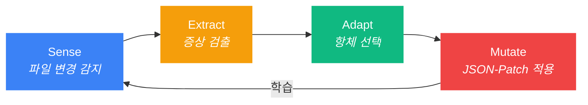

<p align="center">
  
</p>

<h3 align="center">Autonomous Flow Daemon</h3>
<p align="center"><strong>AI가 스스로 치유하는 개발 환경. 270ms 안에 복구 완료.</strong></p>

<p align="center">
  
  
  
  
</p>

---

## 명령어 하나로 끝

> **설정 삽질 없음. 완전한 보호.**

```bash
npx @dotoricode/afd start
```

또는 로컬 설치:

```bash
bun link && afd start
```

이게 전부입니다. `afd`가 알아서 합니다:

- **자동 주입** — Claude Code에 `PreToolUse` 훅을 자동으로 설치합니다. 설정 파일을 직접 만질 필요 없습니다.
- **실시간 감시** — `.claude/`, `CLAUDE.md`, `.cursorrules` 등 핵심 설정 파일을 10ms 단위로 모니터링합니다.
- **자동 치유** — 파일이 삭제되거나 깨지면 **S.E.A.M 사이클**이 백그라운드에서 조용히 복구합니다. 눈치챌 틈도 없습니다.

```
$ afd start
  afd daemon started (pid 4812, port 52413)
  Hook injected into .claude/hooks.json
  Watching: .claude/, CLAUDE.md, .cursorrules
  Ready.
```

> `afd start`를 입력하고, 잊어버리세요. UX의 전부입니다.

---

## S.E.A.M 사이클

`afd`의 핵심 지능. 모든 파일 이벤트는 4단계를 거칩니다:



| 단계 | 동작 | 속도 |
|:------|:-----|:-----|
| **Sense** | Chokidar가 `add`, `change`, `unlink` 이벤트 감지 | < 10ms |
| **Extract** | 면역 엔진이 3개 내장 건강 검진 실행 (IMM-001..003) | < 5ms |
| **Adapt** | SQLite(WAL 모드)에서 저장된 항체와 매칭 | < 1ms |
| **Mutate** | RFC 6902 JSON-Patch로 파일 복원 | < 25ms |

> 전체 사이클: 파일 삭제부터 완전 복구까지 **270ms 미만**.

---

## Magic 5 — 다섯 개의 명령어

필요한 건 전부, 불필요한 건 없음.

| 명령어 | 본질 | 내부 지능 |
|:-------|:-----|:----------|
| `afd start` | **점화** | 데몬 생성 + 훅 자동 주입 |
| `afd fix` | **진단** | 증상 검출 & 항체 학습 |
| `afd score` | **생체 신호** | 건강 대시보드 & 자동 치유 통계 |
| `afd sync` | **연합** | 백신 페이로드 내보내기 (팀 전파용) |
| `afd stop` | **격리** | 안전한 종료 & 정리 |

### 빠른 참조

```bash
afd start      # 데몬 시작, 훅 주입, 감시 시작
afd fix        # 이슈 스캔, 자동 패치, 항체 학습
afd score      # 전체 진단 대시보드
afd sync       # 항체를 .afd/global-vaccine-payload.json으로 내보내기
afd stop       # 안전한 종료
```

---

## 대시보드: `afd score`

```
┌──────────────────────────────────────────────┐
│  afd score — Daemon Diagnostics              │
├──────────────────────────────────────────────┤
│  Ecosystem    : Claude Code                  │
├──────────────────────────────────────────────┤
│  Uptime       : 1h 23m                       │
│  Events       : 156                          │
│  Files Found  : 8                            │
├──────────────────────────────────────────────┤
│  면역 시스템                                   │
│  ──────────────────────────────              │
│  항체          : 7개                          │
│  레벨          : Fortified                    │
│  자동 치유     : 3건                           │
│  마지막 치유   : IMM-003 (12분 전)             │
├──────────────────────────────────────────────┤
│  억제 안전장치                                 │
│  ──────────────────────────────              │
│  Mass event 무시  : 2건                       │
│  Dormant 전환     : 0건                       │
│  활성 First-tap   : 1건                       │
├──────────────────────────────────────────────┤
│  Hologram 절약   : 토큰 84% 절감              │
└──────────────────────────────────────────────┘
```

---

## 고급 지능

### Double-Tap 휴리스틱 (면역 관용)

`afd`는 **실수**와 **의도**를 구분합니다:

```
$ rm .claudeignore            # 첫 번째 삭제 → afd가 조용히 복구
$ rm .claudeignore            # 60초 내 재삭제 → "진짜 지우려는 거구나"
  [afd] Antibody IMM-001 → dormant. 삭제를 존중합니다.
```

| 시나리오 | 반응 |
|:---------|:-----|
| 1회 삭제 (실수) | 자동 복구 + First tap 기록 |
| 60초 내 재삭제 (의도) | 항체 비활성화, 삭제 존중 |
| 60초 후 재삭제 | 새로운 First tap으로 취급, 다시 복구 |
| 1초 내 3건 이상 삭제 (git checkout 등) | Mass-event 감지, 면역 시스템 일시 중단 |

> 설정 파일을 실수로 날려도, `afd`가 270ms 안에 살려놓습니다.
> 진짜로 지우고 싶으면, 두 번 지우세요. `afd`는 당신의 의도를 존중합니다.

### 백신 네트워크 (팀 연합)

학습된 항체를 팀 전체에 공유합니다:

```bash
afd sync
# → .afd/global-vaccine-payload.json
```

페이로드는 정제되어 있습니다 (절대 경로 없음, 시크릿 없음). 다른 프로젝트에 넣으면 면역력을 그대로 이어받습니다.

### Hologram 추출

AI 에이전트가 파일 컨텍스트를 요청하면, `afd`는 **토큰 효율적 뼈대**를 제공합니다 — 주석과 함수 본문을 제거하고 타입 시그니처만 보존합니다:

```
원본: 2,450자 → Hologram: 380자 (84% 절감)
```

AI 에이전트의 컨텍스트 윈도우를 날씬하게 유지하면서, 구조적 이해력은 그대로 보존합니다.

---

## 상태줄 (Status Line)

Claude Code 상태바에서 데몬 상태를 실시간으로 확인:

```
🛡️ afd: OFF                              # 데몬 꺼짐
🛡️ afd: ON                               # 실행 중, 치유 없음
🛡️ afd: ON 🩹1                            # 자동 치유 1건
🛡️ afd: ON | 🩹 3 Healed | last: IMM-003  # 상세 보기
```

---

## 기술 스택

| 레이어 | 기술 | 이유 |
|:-------|:-----|:-----|
| 런타임 | **Bun** | 네이티브 TypeScript, 빠른 SQLite, 싱글 바이너리 |
| 데이터베이스 | **Bun SQLite (WAL)** | 읽기 0.29ms, 쓰기 24ms, 크래시 안전 |
| 파일 감시 | **Chokidar** | 크로스 플랫폼, 검증된 파일 와처 |
| 패치 | **RFC 6902 JSON-Patch** | 결정론적, 조합 가능한 파일 변이 |
| CLI | **Commander.js** | 표준적이고 예측 가능한 명령어 파싱 |

---

## 설치

```bash
# Bun으로 설치 (권장)
bun install
bun link
afd start

# npx로 바로 실행 (설치 불필요)
npx @dotoricode/afd start
```

### 요구 사항

- **Bun** >= 1.0
- **OS**: Windows, macOS, Linux
- **대상**: Claude Code, Cursor (생태계 자동 감지)

---

## 안도감을 주는 UX

`afd`의 디자인 철학은 단순합니다:

> **"설정 삽질을 원천 차단하고, AI가 스스로 치유하는 프로젝트를 만든다."**

설정 파일이 날아가서 30분을 허비한 경험. `git checkout` 한 번에 훅이 증발한 경험. `afd`는 그런 순간이 다시 오지 않도록 백그라운드에서 묵묵히 지켜줍니다.

당신은 코드에만 집중하세요. 나머지는 `afd`가 합니다.

---

## 라이선스

MIT

