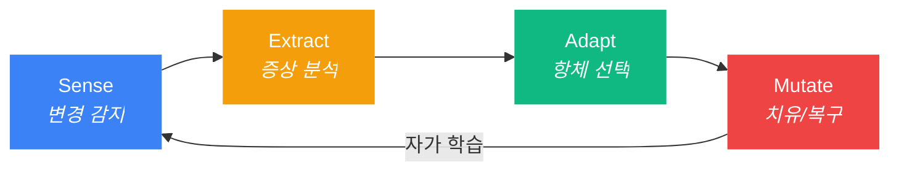

<p align="center">
  
</p>

<h3 align="center">Autonomous Flow Daemon (afd)</h3>
<p align="center"><strong>AI가 스스로 고치는 개발 환경. 복구까지 단 0.2초.</strong></p>

<p align="center">
  
  <br>
  <br>
  <b>🛡️ 불멸의 컨텍스트 흐름:</b> 
  <em>"afd는 지연 시간이 거의 없는 즉각적인 복구를 통해, AI 개발 흐름이 끊기지 않도록 보호하고 토큰 비용을 혁신적으로 절감합니다."</em>
</p>

<p align="center">
  
  <a href="https://www.npmjs.com/package/autonomous-flow-daemon"></a>
  
  
  
</p>

<p align="center">
  <a href="README.md">English</a>
</p>

---

## 왜 afd인가?

> [afd] 🛡️ AI가 '.claudeignore'를 삭제했습니다 | 🩹 184ms 만에 자가 복구 완료 | 컨텍스트 보존됨.

당신은 지금 몰입의 정점에 있습니다. AI 에이전트가 실수로 설정 파일을 삭제하거나, 훅 파일을 망가뜨립니다. `afd` 없이는 작업을 멈추고, 원인을 진단하고, 직접 고쳐야 합니다: **30분이 날아갑니다**.

`afd`가 있다면, 데몬이 10ms 만에 이상을 감지하고, 184ms 안에 복구를 완료합니다. **당신은 아무것도 몰랐습니다.**

| 상황 | afd 없을 때 | afd 있을 때 |
|:-----|:------------|:------------|
| AI가 `.claudeignore` 삭제 | 30분 수동 복구 | **0.2초 자동 치유** |
| 훅 파일 손상 | 훅 재주입, 세션 재시작 | **백그라운드 자동 복구** |
| `git checkout`으로 파일 50개 동시 변경 | AI가 폭주 | **대규모 이벤트 억제기 작동** |
| 신규 팀원, 환경 설정 없음 | 구전으로 전달 | **`afd sync`로 즉시 백신 접종** |

---

## 🚀 제로-간섭 약속 (Zero-Interference Promise)

`afd`는 개발 흐름을 방해하는 것이 아니라, 보호하기 위해 설계되었습니다.

* **성능 저하 없음:** Bun 기반의 네이티브 백그라운드 데몬으로 실행되어, **CPU 점유율 0.1% 미만**, **메모리 약 40MB**만을 사용합니다.
* **매끄러운 복구:** **밀리초 미만(Sub-millisecond)의 복구 속도**를 통해, Claude Code가 컨텍스트 오류를 인지하기도 전에 파일을 원래대로 되돌려 놓습니다.
* **비침습적 설계:** `afd`는 OS 계층에서 파일 시스템 이벤트만 관찰합니다. Claude Code의 내부 실행이나 API 호출을 가로채거나 수정하지 않습니다.

---

## ✨ 주요 기능 (v1.3.0)

| 기능 | 설명 |
|:-----|:-----|
| **🛡️ S.E.A.M 자율 치유** | 파일 삭제/손상을 감지하고 270ms 이내에 복구 — AI 에이전트가 눈치채기도 전에 |
| **🔒 격리 구역 (Quarantine)** | 복구 전에 손상된 파일을 `.afd/quarantine/`에 백업 — 사후 분석용 증거 보존 |
| **🧬 자가 진화 (Self-Evolution)** | 격리된 실패 사례를 분석하여 `afd-lessons.md`에 방지 규칙 자동 생성 — AI가 스스로 배움 |
| **📊 홀로그램 추출** | MCP 도구 `afd_hologram`으로 80%+ 가벼운 타입 뼈대를 AI 에이전트에 제공 |
| **🔌 MCP 통합** | `afd mcp install`로 MCP 서버 자동 등록 — AI가 `afd_hologram`, `afd_diagnose`, `afd_score`를 자율 호출 |
| **📺 실시간 대시보드** | `afd watch` — SSE 이벤트 스트림, 진화 통계, 치유 지표를 보여주는 실시간 TUI |
| **🔍 스마트 탐색** | `.claude/`, `.cursorrules`, `.mcp.json` 등 AI 설정 파일을 자동 감지 — 설정 필요 없음 |
| **🧬 더블탭 감지** | 실수와 의도를 구분 — 한 번 지우면 복구, 30초 내 다시 지우면 삭제를 존중 |
| **💉 백신 네트워크** | `afd sync`로 학습된 항체를 팀 전체에 전파 |
| **🌐 자동 다국어** | 시스템 언어에 따라 한국어/영어를 자동 전환 |

---

## 🚀 명령어 한 줄로 끝나는 경험

> **"더 이상의 설정 삽질은 없습니다. 완전한 방어 환경을 구축하세요."**

```bash
npx @dotoricode/afd start
```

로컬에 설치하여 사용하려면:

```bash
bun link && afd start
```

이게 전부입니다. 나머지는 `afd`가 알아서 처리합니다:

- **자동 훅(Hook) 주입** — Claude Code의 `PreToolUse` 훅을 자동으로 설치합니다. 더 이상 `.json` 파일을 직접 수정하며 고생하지 마세요.
- **초고속 실시간 감시** — `.claude/`, `CLAUDE.md`, `.cursorrules`, `.claudeignore`, `.gitignore` 핵심 파일을 10ms 단위로 모니터링합니다.
- **배경 자율 치유** — 파일이 삭제되거나 손상되면 **S.E.A.M 사이클**이 조용히 복구합니다. 사용자가 눈치채기도 전에 모든 상황은 종료됩니다.

```
$ afd start
  🛡️ 데몬 시작 (pid 4812, port 52413)
  🛡️ 스마트 탐색 중: AI 컨텍스트 대상 7개 감시 시작
  Targets: .claude/, CLAUDE.md, .cursorrules, .claudeignore, .gitignore, mcp-config.json, .mcp.json
  ✅ .claude/hooks.json에 감시 훅 주입 완료
```

> `afd start`를 치고 나면 그냥 잊어버리세요. 그것이 우리가 추구하는 최고의 UX입니다.

---

## 🧠 지능형 치유 엔진: S.E.A.M 사이클

`afd`의 핵심 로직입니다. 모든 파일 변화는 다음의 4단계를 거쳐 즉시 정제됩니다:



| 단계 | 주요 동작 | 처리 속도 |
|:------|:-----|:-----|
| **Sense** | Chokidar 와처가 파일의 생성, 변경, 삭제를 즉각 감지 | < 10ms |
| **Extract** | 홀로그램(타입 뼈대) 생성 + 건강 검진 실행 | < 5ms |
| **Adapt** | 증상↔항체 매칭, 손상 파일 격리, 수정 전략 선택 | < 1ms |
| **Mutate** | RFC 6902 JSON-Patch 기술로 원본 파일을 완벽히 복원 | < 25ms |

> **최종 성적표:** 파일 삭제 감지부터 복구 완료까지 **270ms 미만**.

### 감시 대상 (Watch Targets)

아래 파일들이 실시간 감시됩니다. 면역 파일(IMM-*)은 삭제 시 자동으로 복구됩니다:

| 대상 | 유형 | 항체 | 자동 복구 |
|:-----|:-----|:-----|:----------|
| `.claude/` | 디렉토리 | IMM-002 (`hooks.json`) | ✅ |
| `CLAUDE.md` | 파일 | IMM-003 | ✅ |
| `.claudeignore` | 파일 | IMM-001 | ✅ |
| `.cursorrules` | 파일 | — | 이벤트 로깅만 |
| `.gitignore` | 파일 | — | 이벤트 로깅만 |
| `mcp-config.json` | 파일 | — | 🔍 스마트 탐색 |
| `.mcp.json` | 파일 | — | 🔍 스마트 탐색 |
| `.ai/` | 디렉토리 | — | 🔍 스마트 탐색 |
| `.windsurfrules` | 파일 | — | 🔍 스마트 탐색 |

> 항체는 **데몬 시작 시 자동으로 학습**되며, **파일 변경 시마다 갱신**됩니다 — 복구 시 항상 최신 내용이 반영됩니다.
>
> 🔍 **스마트 탐색**은 시작 시 12개 이상의 AI 설정 패턴을 0.1ms 미만으로 스캔하여, 발견된 파일을 자동으로 감시 목록에 추가합니다.

---

## 🛠️ 명령어

복잡한 건 빼고, 꼭 필요한 것만 담았습니다.

| 명령어 | 역할 | 핵심 지능 |
|:-------|:-----|:----------|
| `afd start` | **시동** | 스마트 탐색 + 데몬 가동 + 훅/MCP 자동 주입 |
| `afd stop` | **종료** | 근무 요약 리포트 + 안전한 종료 |
| `afd score` | **대시보드** | 진화·홀로그램 통계 포함 다국어 건강 검진 |
| `afd fix` | **수술** | 홀로그램 컨텍스트 기반 진단 및 항체 학습 |
| `afd sync` | **전파** | 학습된 항체를 백신 파일로 추출 (팀 공유용) |
| `afd watch` | **모니터** | 실시간 TUI — SSE 이벤트 스트림 대시보드 |
| `afd doctor` | **정밀 검사** | 종합 건강 분석 + 자동 수정 권고 |
| `afd evolution` | **학습** | 격리된 실패 분석 및 방지 규칙 생성 |
| `afd mcp install` | **연결** | MCP 서버를 프로젝트 + 글로벌 설정에 등록 |
| `afd diagnose` | **헤드리스** | 자동 치유 훅용 기계 판독 진단 |
| `afd vaccine` | **레지스트리** | 커뮤니티 항체 조회, 설치, 발행 |
| `afd lang` | **언어** | 표시 언어 전환 (`afd lang ko` / `afd lang en`) |

---

## 📊 실시간 대시보드: `afd score`

```
┌──────────────────────────────────────────────┐
│  afd score — 프로젝트 건강 검진              │
├──────────────────────────────────────────────┤
│  에코시스템   : Claude Code                  │
├──────────────────────────────────────────────┤
│  가동 시간    : 1h 23m                       │
│  이벤트       : 156                          │
│  감지된 파일  : 8                            │
├──────────────────────────────────────────────┤
│  면역 시스템                                 │
│  ──────────────────────────────              │
│  항체 수      : 7                            │
│  방어 레벨    : 철통 방어                    │
│  자동 치유    : 3건 백그라운드 치유됨        │
├──────────────────────────────────────────────┤
│  📈 전달된 가치                              │
│  ──────────────────────────────              │
│  절약한 토큰  : ~2.9K                        │
│  아낀 시간    : ~40 min                      │
│  절감 비용    : ~$0.01                       │
├──────────────────────────────────────────────┤
│  🗣️ 면역 체계 이상 무. 오늘도 한 건         │
│     해결했습니다 💪                          │
└──────────────────────────────────────────────┘
```

> `afd lang en` 을 실행하면 대시보드의 모든 레이블이 영어로 전환됩니다.

---

## 💎 고도로 설계된 안전 장치

### Double-Tap 휴리스틱 (의도와 실수의 구분)

`afd`는 바보처럼 무조건 되살리지 않습니다. 사용자의 **진짜 의도**를 읽습니다:

```bash
$ rm .claudeignore      # 1차 삭제: "실수인가 보군." → 즉시 복구
$ rm .claudeignore      # 30초 내 재삭제: "진짜 지우고 싶구나?"
  🫡 [afd] 사용자 의도 확인. 항체 IMM-001 휴면 전환. 삭제를 존중합니다.
```

- **실수 방어:** 한 번의 삭제는 0.2초 만에 즉시 복구합니다.
- **의도 존중:** 30초 내에 같은 파일을 또 지우면 사용자의 확고한 의지로 판단해 복구를 멈춥니다.
- **Git 쇼크 방지:** `git checkout`처럼 수많은 파일이 한꺼번에 바뀌는 상황(1초 내 3개 이상)은 '대규모 이벤트'로 자동 인식하여 과도한 치유 동작을 멈춥니다.

### 백신 네트워크 (팀 전파)

나만 똑똑해지는 게 아닙니다. 내가 발견한 해결책을 팀원 모두에게 전파하세요:

```bash
afd sync
# → .afd/global-vaccine-payload.json 생성
```
이 파일은 정제되어 있어 기밀 정보가 섞이지 않습니다. 다른 프로젝트에 넣기만 하면 `afd`가 해당 프로젝트의 면역력을 즉시 이식받습니다.

### 격리 구역 (Quarantine Zone)

파일을 복구하기 전에, 손상된 버전을 `.afd/quarantine/`에 백업합니다:

```
.afd/quarantine/
  20260401_021028_.claude_hooks.json        # JSON 괄호 누락된 상태
  20260401_022040_.claudeignore.learned     # 삭제 이벤트 (분석 완료)
```

사후 분석용 증거를 보존하며, 자가 진화 엔진의 학습 데이터로 활용됩니다.

### 자가 진화 (Self-Evolution)

```bash
afd evolution
```

격리된 실패 사례를 분석하고, 복구된 원본과 비교하여 `afd-lessons.md`에 방지 규칙을 자동 기록합니다:

```markdown
### .claude/hooks.json (2026-04-01 02:10:28)
- **Type**: Content Corruption
- **Rule**: `.claude/hooks.json` 편집 시 반드시 유효한 JSON 구문을 유지할 것.
  흔한 실수: '}' 누락. 편집 후 항상 JSON 구조를 검증할 것.
```

AI 에이전트는 면역 파일 편집 전에 `afd-lessons.md`를 읽어 — 과거의 실패를 미래의 예방책으로 전환합니다.

### Hologram 추출 (MCP 기반 토큰 다이어트)

AI 에이전트가 파일 컨텍스트를 필요로 할 때, MCP 도구 `afd_hologram`이 **타입 뼈대만 남긴 초경량 요약본**을 제공합니다:

```
원본: 8,425 chars → 홀로그램: 1,193 chars (85.8% 절감)
```

import, interface, 타입 시그니처, 함수 시그니처는 보존하고 구현부는 모두 제거합니다. AI 에이전트가 대용량 파일을 읽기 전에 자동으로 호출합니다.

---

## 🔌 Plugin / MCP 설정

`afd`는 AI 에이전트가 자율적으로 호출할 수 있는 3개의 MCP 도구를 제공합니다:

| MCP 도구 | 용도 |
|:---------|:-----|
| `afd_hologram` | TS/JS 파일의 토큰 효율적 타입 뼈대 반환 (80%+ 절감) |
| `afd_diagnose` | 건강 진단 실행, 홀로그램 컨텍스트와 함께 증상 반환 |
| `afd_score` | 데몬 런타임 통계: 가동시간, 치유 횟수, 홀로그램 절감률 |

### 원커맨드 설정 (권장)

```bash
afd mcp install
```

`.mcp.json`(프로젝트)과 `~/.claude.json`(글로벌) 양쪽에 MCP 서버를 자동 등록합니다. Claude Code를 재시작하면 활성화됩니다.

### 수동 설정

`.mcp.json`에 직접 추가:

```json
{
  "mcpServers": {
    "afd": {
      "command": "bun",
      "args": ["run", "src/daemon/server.ts", "--mcp"]
    }
  }
}
```

등록 후 AI 에이전트가 `afd_hologram`으로 파일 구조를 효율적으로 읽고, 상태 표시줄에서 실시간 확인:

```
🛡️ afd: ON | 🩹 3 Healed | last: IMM-003
```

---

## 🛠️ 기술 스택

| 계층 | 기술 | 선택 이유 |
|:-----|:-----|:----------|
| 런타임 | **Bun** | 네이티브 TypeScript, 초고속 SQLite, 단일 바이너리 |
| 데이터베이스 | **Bun SQLite (WAL)** | 읽기 0.29ms, 쓰기 24ms, 크래시 안전 |
| 파일 감시 | **Chokidar** | 크로스플랫폼, 실전 검증된 와처 |
| 패칭 | **RFC 6902 JSON-Patch** | 결정론적이고 조합 가능한 파일 변이 |
| CLI | **Commander.js** | 표준적이고 예측 가능한 커맨드 파싱 |
| 다국어 | **자체 i18n 엔진** | 외부 의존성 없이 0.01ms로 언어 전환 |

---

## 📦 설치 및 시작하기

```bash
# Bun 사용 권장
bun install
bun link
afd start

# 설치 없이 바로 실행하기 (npx)
npx @dotoricode/afd start
```

### 환경 요구 사항
- **Bun** >= 1.0
- **OS**: Windows, macOS, Linux 지원
- **호환 환경**: Claude Code, Cursor, Windsurf, Codex (생태계 자동 감지)

---

## 🛡️ 안도감을 주는 UX

`afd`의 목표는 명확합니다.

> **"설정 파일 하나 날아가서 30분을 허비하는 그런 날은 이제 끝났습니다."**

당신은 코드에만 집중하세요. 프로젝트 환경의 건강은 `afd`가 24시간 백그라운드에서 지켜드립니다.

---

## 라이선스
MIT
