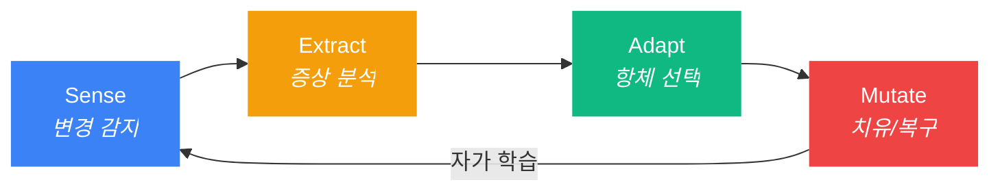

<p align="center">
  
</p>

<h3 align="center">Autonomous Flow Daemon (afd)</h3>
<p align="center"><strong>AI가 스스로 고치는 개발 환경. 복구까지 단 0.2초.</strong></p>

<p align="center">
  
  <a href="https://www.npmjs.com/package/autonomous-flow-daemon"></a>
  
  
  
</p>

<p align="center">
  <a href="README.md">English</a>
</p>

---

## 왜 afd인가?

> [afd] 🛡️ AI가 '.claudeignore'를 삭제했습니다 | 🩹 184ms 만에 자가 복구 완료 | 컨텍스트 보존됨.

당신은 지금 몰입의 정점에 있습니다. AI 에이전트가 실수로 설정 파일을 삭제하거나, 훅 파일을 망가뜨립니다. `afd` 없이는 작업을 멈추고, 원인을 진단하고, 직접 고쳐야 합니다: **30분이 날아갑니다**.

`afd`가 있다면, 데몬이 10ms 만에 이상을 감지하고, 184ms 안에 복구를 완료합니다. **당신은 아무것도 몰랐습니다.**

| 상황 | afd 없을 때 | afd 있을 때 |
|:-----|:------------|:------------|
| AI가 `.claudeignore` 삭제 | 30분 수동 복구 | **0.2초 자동 치유** |
| 훅 파일 손상 | 훅 재주입, 세션 재시작 | **백그라운드 자동 복구** |
| `git checkout`으로 파일 50개 동시 변경 | AI가 폭주 | **대규모 이벤트 억제기 작동** |
| 신규 팀원, 환경 설정 없음 | 구전으로 전달 | **`afd sync`로 즉시 백신 접종** |

---

## 🚀 명령어 한 줄로 끝나는 경험

> **"더 이상의 설정 삽질은 없습니다. 완전한 방어 환경을 구축하세요."**

```bash
npx @dotoricode/afd start
```

로컬에 설치하여 사용하려면:

```bash
bun link && afd start
```

이게 전부입니다. 나머지는 `afd`가 알아서 처리합니다:

- **자동 훅(Hook) 주입** — Claude Code의 `PreToolUse` 훅을 자동으로 설치합니다. 더 이상 `.json` 파일을 직접 수정하며 고생하지 마세요.
- **초고속 실시간 감시** — `.claude/`, `CLAUDE.md`, `.cursorrules` 등 핵심 파일을 10ms 단위로 모니터링합니다.
- **배경 자율 치유** — 파일이 삭제되거나 손상되면 **S.E.A.M 사이클**이 조용히 복구합니다. 사용자가 눈치채기도 전에 모든 상황은 종료됩니다.

```
$ afd start
  🛡️ afd 데몬 시작 (pid 4812, port 52413)
  ✅ .claude/hooks.json에 감시 훅 주입 완료
  👀 감시 중: .claude/, CLAUDE.md, .cursorrules
  ✨ 준비되었습니다.
```

> `afd start`를 치고 나면 그냥 잊어버리세요. 그것이 우리가 추구하는 최고의 UX입니다.

---

## 🧠 지능형 치유 엔진: S.E.A.M 사이클

`afd`의 핵심 로직입니다. 모든 파일 변화는 다음의 4단계를 거쳐 즉시 정제됩니다:



| 단계 | 주요 동작 | 처리 속도 |
|:------|:-----|:-----|
| **Sense** | Chokidar 와처가 파일의 생성, 변경, 삭제를 즉각 감지 | < 10ms |
| **Extract** | 면역 엔진이 내장된 3단계 건강 검진 실행 (IMM-001..003) | < 5ms |
| **Adapt** | SQLite(WAL 모드) DB에서 최적의 복구 항체(Antibody) 매칭 | < 1ms |
| **Mutate** | RFC 6902 JSON-Patch 기술로 원본 파일을 완벽히 복원 | < 25ms |

> **최종 성적표:** 파일 삭제 감지부터 복구 완료까지 **270ms 미만**.

---

## 🛠️ Magic 5 — 핵심 명령어

복잡한 건 빼고, 꼭 필요한 5가지만 담았습니다.

| 명령어 | 역할 | 핵심 지능 |
|:-------|:-----|:----------|
| `afd start` | **시동** | 백그라운드 데몬 가동 및 자동 훅 주입 |
| `afd fix` | **수술** | 현재 프로젝트 진단 및 새로운 항체 학습 |
| `afd score` | **대시보드** | 프로젝트 건강 점수 및 치유 통계 확인 |
| `afd sync` | **전파** | 학습된 항체를 백신 파일로 추출 (팀 공유용) |
| `afd stop` | **종료** | 데몬을 안전하게 끄고 프로세스 정리 |

---

## 📊 실시간 대시보드: `afd score`

```
┌──────────────────────────────────────────────┐
│  afd score — 프로젝트 건강 검진 리포트             │
├──────────────────────────────────────────────┤
│  에코시스템    : Claude Code                    │
├──────────────────────────────────────────────┤
│  가동 시간     : 1시간 23분                      │
│  감지된 이벤트 : 156건                           │
│  보호 중인 파일: 8개                             │
├──────────────────────────────────────────────┤
│  면역 시스템 상태 (Immune System)                │
│  ──────────────────────────────              │
│  보유 항체     : 7개                            │
│  방어 레벨     : 철통 보안 (Fortified)           │
│  자동 치유     : 3건 (백그라운드 처리)              │
│  최근 치유     : IMM-003 (.claudeignore 복구)   │
├──────────────────────────────────────────────┤
│  억제 안전장치 (Safety)                         │
│  ──────────────────────────────              │
│  대규모 이벤트 무시: 2건 (git checkout 등)         │
│  의도적 삭제 허용  : 0건 (Dormant 전환)            │
├──────────────────────────────────────────────┤
│  Hologram 절약   : 토큰 소모량 84% 감소           │
└──────────────────────────────────────────────┘
```

---

## 💎 고도로 설계된 안전 장치

### Double-Tap 휴리스틱 (의도와 실수의 구분)

`afd`는 바보처럼 무조건 되살리지 않습니다. 사용자의 **진짜 의도**를 읽습니다:

```bash
$rm .claudeignore      # 1차 삭제: "실수인가 보군." -> 즉시 복구$ rm .claudeignore      # 60초 내 재삭제: "진짜 지우고 싶구나?" 
  🛡️ [afd] 사용자 의도 확인. 항체 IMM-001 휴면 전환. 삭제를 존중합니다.
```

- **실수 방어:** 한 번의 삭제는 0.2초 만에 즉시 복구합니다.
- **의도 존중:** 1분 내에 같은 파일을 또 지우면 사용자의 확고한 의지로 판단해 복구를 멈춥니다.
- **Git 쇼크 방지:** `git checkout`처럼 수많은 파일이 한꺼번에 바뀌는 상황(1초 내 3개 이상)은 '대규모 이벤트'로 자동 인식하여 과도한 치유 동작을 멈춥니다.

### 백신 네트워크 (팀 전파)

나만 똑똑해지는 게 아닙니다. 내가 발견한 해결책을 팀원 모두에게 전파하세요:

```bash
afd sync
# → .afd/global-vaccine-payload.json 생성
```
이 파일은 정제되어 있어 기밀 정보가 섞이지 않습니다. 다른 프로젝트에 넣기만 하면 `afd`가 해당 프로젝트의 면역력을 즉시 이식받습니다.

### Hologram 추출 (토큰 다이어트)

AI 에이전트가 파일 내용을 요구할 때, `afd`는 **뼈대만 남긴 초경량 요약본**을 제공합니다. 주석과 긴 함수 본문은 걷어내고 타입 정의와 구조만 전달하여 **토큰 비용을 80% 이상 절감**합니다.

---

## 🔌 Plugin / MCP 설정

`afd`를 **Model Context Protocol (MCP) 서버**로 등록하면 Claude Code가 시작될 때 데몬이 자동으로 실행됩니다.

### 자동 설정 (권장)

Claude Code MCP 설정(`~/.claude/mcp.json` 또는 프로젝트 `.mcp.json`)에 추가하세요:

```json
{
  "mcpServers": {
    "afd": {
      "command": "bun",
      "args": ["run", "src/cli.ts", "start"]
    }
  }
}
```

### 수동 실행

```bash
afd start   # 백그라운드 데몬 시작 및 훅 자동 주입
```

등록 후 Claude Code 상태 표시줄에서 실시간으로 확인할 수 있습니다:

```
🛡️ afd: ON | 🩹 3 Healed | last: IMM-003
```

---

## 🛠️ 기술 스택

- **Runtime**: **Bun** — 초고속 실행 속도와 네이티브 SQLite 지원.
- **Database**: **SQLite (WAL)** — 읽기 0.29ms의 압도적 성능과 크래시 안전성.
- **Patching**: **RFC 6902 JSON-Patch** — 파일의 미세한 변화를 가장 정교하게 복원하는 기술.

---

## 📦 설치 및 시작하기

```bash
# Bun 사용 권장
bun install
bun link
afd start

# 설치 없이 바로 실행하기 (npx)
npx @dotoricode/afd start
```

### 환경 요구 사항
- **Bun** >= 1.0
- **OS**: Windows, macOS, Linux 지원
- **호환 환경**: Claude Code, Cursor 등 (생태계 자동 감지)

---

## 🛡️ 안도감을 주는 UX

`afd`의 목표는 명확합니다.

> **"설정 파일 하나 날아가서 30분을 허비하는 그런 날은 이제 끝났습니다."**

당신은 코드에만 집중하세요. 프로젝트 환경의 건강은 `afd`가 24시간 백그라운드에서 지켜드립니다.

---

## 라이선스
MIT
