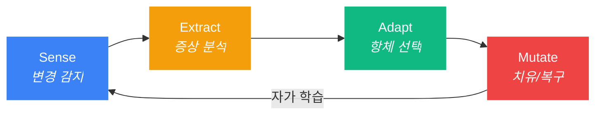

<p align="center">
  
</p>

<h3 align="center">Autonomous Flow Daemon (afd)</h3>
<p align="center"><strong>AI가 스스로 고치는 개발 환경. 복구까지 단 0.2초.</strong></p>

<p align="center">
  <a href="https://github.com/dotoricode/autonomous-flow-daemon">
    
  </a>
</p>

---

<p align="center">
  
  <a href="https://www.npmjs.com/package/autonomous-flow-daemon"></a>
  
  
  
</p>

<p align="center">
  <a href="README.md">English</a>
</p>

---

## 왜 afd인가?

> [afd] AI가 '.claudeignore'를 삭제했습니다 | 184ms 만에 자가 복구 완료 | 컨텍스트 보존됨.

AI 에이전트가 실수로 설정 파일을 삭제하거나, 훅 파일을 망가뜨립니다. `afd` 없이는 작업을 멈추고, 원인을 진단하고, 직접 고쳐야 합니다: **30분이 날아갑니다**.

`afd`가 있다면, 데몬이 10ms 만에 이상을 감지하고, 184ms 안에 복구를 완료합니다. **당신은 아무것도 몰랐습니다.** Bun 기반 네이티브 데몬으로 CPU 0.1% 미만, 메모리 ~40MB만 사용합니다.

| 상황 | afd 없을 때 | afd 있을 때 |
|:-----|:------------|:------------|
| AI가 `.claudeignore` 삭제 | 30분 수동 복구 | **0.2초 자동 치유** |
| 훅 파일 손상 | 훅 재주입, 세션 재시작 | **백그라운드 자동 복구** |
| `git checkout`으로 파일 50개 동시 변경 | AI가 폭주 | **대규모 이벤트 억제기 작동** |
| AI가 대용량 파일 8개 읽기 (114KB) | ~28,600 토큰 소비 | **홀로그램으로 ~1,700 토큰 (94% 절감)** |

---

## 주요 기능

| 기능 | 설명 |
|:-----|:-----|
| **S.E.A.M 자율 치유** | 파일 삭제/손상을 감지하고 270ms 이내에 복구 |
| **홀로그램 추출** | MCP를 통해 80-93% 가벼운 타입 뼈대를 AI 에이전트에 제공, 토큰 비용 대폭 절감 |
| **스마트 파일 리더** | `afd_read` — 작은 파일은 원본, 큰 파일은 자동 홀로그램 압축; 라인 범위 읽기 지원 |
| **워크스페이스 맵** | `afd://workspace-map` — 전체 파일 트리 + export 시그니처를 한 번에 제공 |
| **홀로그램 L1** | import 기반 정밀 압축 — 실제 import된 심볼만 전체 시그니처 유지 (85%+ 절감) |
| **격리 구역** | 복구 전 손상된 파일을 `.afd/quarantine/`에 백업 |
| **자가 진화** | 격리된 실패 사례를 분석하여 `afd-lessons.md`에 방지 규칙 자동 생성 |
| **실수 이력 주입** | PreToolUse 훅이 파일 편집 전 과거 실수를 경고로 주입 |
| **더블탭 감지** | 한 번 삭제 = 자동 복구; 30초 내 재삭제 = 사용자 의도로 존중 |
| **백신 네트워크** | `afd sync`로 학습된 항체를 팀 전체에 전파 |
| **MCP 통합** | `afd mcp install`로 MCP 서버 자동 등록 |
| **HUD 방어 카운터** | 상태 표시줄에 방어 건수와 사유 요약을 한눈에 표시 |

---

## 토큰 절약 — 실측 데이터

홀로그램 시스템은 AI 기반 개발에서 afd의 가장 큰 가치입니다. 실제 세션에서 측정한 결과입니다:

### 세션 스냅샷 (실제 코딩 세션에서 측정)

| 지표 | 값 |
|:-----|:---|
| 홀로그램 요청 횟수 | 8회 |
| 대상 파일 총 크기 | ~114.5 KB (8개 파일, 평균 14.3 KB) |
| 원본 토큰 비용 | ~28,600 토큰 |
| 홀로그램 압축 후 | ~1,700 토큰 |
| **절약된 토큰** | **~26,900 토큰 (94% 절감)** |

### 규모별 효과

```
세션 사용 토큰 (ctx ~15%):  ~150,000  ████████████████
홀로그램 절약 토큰:          ~26,900  ██░░░░░░░░░░░░░░  (세션의 18%)
```

ctx 50% 이상에서는 파일 읽기가 토큰 예산의 대부분을 차지합니다. 홀로그램 없이 대용량 파일 8개를 읽으면 매번 ~28.6K 토큰이 소비됩니다. 홀로그램을 사용하면 **각 파일을 원본의 1/16 비용**으로 읽을 수 있으며, 반복 읽기가 많을수록 격차는 더 벌어집니다.

### 토큰 최적화 3단계

| 레이어 | 도구 | 절감률 | 방식 |
|:-------|:-----|:-------|:-----|
| **L0 홀로그램** | `afd_hologram` | 80%+ | 함수 본문 제거, 타입 시그니처만 보존 |
| **L1 홀로그램** | `afd_hologram` + `contextFile` | 85%+ | import된 심볼만 필터링 |
| **스마트 리더** | `afd_read` | 자동 | 10KB 미만은 원본, 이상은 자동 홀로그램 |
| **워크스페이스 맵** | `afd://workspace-map` | N/A | 프로젝트 전체 구조를 한 번에 파악 |

---

## 명령어 한 줄로 시작

```bash
npx @dotoricode/afd start
```

로컬에 설치하여 사용하려면:

```bash
bun link && afd start
```

이게 전부입니다. 나머지는 `afd`가 알아서 처리합니다:

- **자동 훅 주입** — Claude Code의 `PreToolUse` 훅을 자동으로 설치합니다.
- **초고속 실시간 감시** — 핵심 설정 파일을 10ms 단위로 모니터링합니다.
- **배경 자율 치유** — S.E.A.M 사이클이 조용히 복구합니다.

```
$ afd start
  데몬 시작 (pid 4812, port 52413)
  스마트 탐색: AI 컨텍스트 대상 7개 감시 시작
  .claude/hooks.json에 감시 훅 주입 완료
```

---

## S.E.A.M 사이클

모든 파일 이벤트는 4단계를 거쳐 처리됩니다:



| 단계 | 주요 동작 | 처리 속도 |
|:------|:-----|:-----|
| **Sense** | Chokidar 와처가 파일 생성, 변경, 삭제를 즉각 감지 | < 10ms |
| **Extract** | 홀로그램(타입 뼈대) 생성 + 건강 검진 실행 | < 5ms |
| **Adapt** | 증상-항체 매칭, 손상 파일 격리, 수정 전략 선택 | < 1ms |
| **Mutate** | RFC 6902 JSON-Patch로 원본 파일 복원 | < 25ms |

> 전체 사이클: 파일 삭제 감지부터 복구 완료까지 **270ms 미만**.

---

## 명령어

| 명령어 | 설명 |
|:-------|:-----|
| `afd start` | 스마트 탐색 + 데몬 가동 + 훅/MCP 자동 주입 |
| `afd stop` | 근무 요약 리포트 + 안전한 종료 (`--clean`으로 훅/MCP 제거) |
| `afd score` | 진화/홀로그램 통계 포함 건강 대시보드 |
| `afd fix` | 홀로그램 컨텍스트 기반 진단 및 항체 학습 |
| `afd sync` | 백신 페이로드 추출/가져오기 (`--push`, `--pull`, `--remote <url>`) |
| `afd restart` | 종료 후 재시작 |
| `afd status` | 빠른 건강 확인 — 데몬, 훅, MCP, 방어 현황 |
| `afd doctor` | 종합 건강 분석 + 자동 수정 권고 |
| `afd evolution` | 격리된 실패 분석 및 방지 규칙 생성 |
| `afd mcp install` | MCP 서버를 프로젝트 + 글로벌 설정에 등록 |
| `afd vaccine` | 커뮤니티 항체 조회, 설치, 발행 |
| `afd lang` | 표시 언어 전환 (`afd lang ko` / `afd lang en`) |

---

## 고급 기능

### Double-Tap 휴리스틱

`afd`는 **실수**와 **의도**를 구분합니다:

```
$ rm .claudeignore            # 1차 삭제 -> 즉시 복구
$ rm .claudeignore            # 30초 내 재삭제 -> "진짜 지우고 싶구나?"
  [afd] 사용자 의도 확인. 항체 IMM-001 휴면 전환. 삭제를 존중합니다.
```

| 시나리오 | 대응 |
|:---------|:-----|
| 단일 삭제 (실수) | 자동 복구 + 첫 탭 기록 |
| 30초 내 재삭제 (의도) | 항체 휴면, 삭제 존중 |
| 1초 내 3건 이상 (git checkout) | 대규모 이벤트 감지, 억제 일시 정지 |

### 백신 네트워크

```bash
afd sync              # .afd/global-vaccine-payload.json으로 추출
afd sync --push       # 원격으로 백신 전파
afd sync --pull       # 원격에서 백신 수신
```

페이로드는 정제되어 있어 기밀 정보가 포함되지 않습니다.

### 자가 진화

```bash
afd evolution
```

격리된 실패 사례를 분석하고 `afd-lessons.md`에 방지 규칙을 자동 기록합니다. AI 에이전트는 면역 파일 편집 전에 이를 읽어 과거의 실패를 미래의 예방책으로 전환합니다.

---

## MCP 설정

`afd`가 제공하는 MCP 도구와 리소스:

| MCP 도구 | 용도 |
|:---------|:-----|
| `afd_read` | 스마트 파일 리더 — 작은 파일은 원본, 큰 파일은 자동 홀로그램, 라인 범위 지원 |
| `afd_hologram` | TS/JS 파일의 토큰 효율적 타입 뼈대 (80%+ 절감) |
| `afd_diagnose` | 건강 진단 + 홀로그램 컨텍스트 |
| `afd_score` | 런타임 통계: 가동시간, 치유 횟수, 홀로그램 절감률 |

| MCP 리소스 | 용도 |
|:-----------|:-----|
| `afd://workspace-map` | 전체 파일 트리 + export 시그니처를 한 번에 제공 |

```bash
afd mcp install    # .mcp.json + ~/.claude.json에 자동 등록
```

---

## 기술 스택

| 계층 | 기술 | 선택 이유 |
|:-----|:-----|:----------|
| 런타임 | **Bun** | 네이티브 TypeScript, 초고속 SQLite, 단일 바이너리 |
| 데이터베이스 | **Bun SQLite (WAL)** | 읽기 0.29ms, 쓰기 24ms, 크래시 안전 |
| 파일 감시 | **Chokidar** | 크로스플랫폼, 실전 검증된 와처 |
| 패칭 | **RFC 6902 JSON-Patch** | 결정론적이고 조합 가능한 파일 변이 |
| CLI | **Commander.js** | 표준적이고 예측 가능한 커맨드 파싱 |

---

## 설치

```bash
# Bun 사용 권장
bun install
bun link
afd start

# 설치 없이 바로 실행 (npx)
npx @dotoricode/afd start
```

### 환경 요구 사항

- **Bun** >= 1.0
- **OS**: Windows, macOS, Linux
- **호환 환경**: Claude Code, Cursor, Windsurf, Codex (생태계 자동 감지)

---

## 라이선스

MIT
