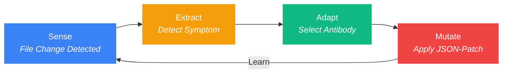

<p align="center">
  
</p>

<h3 align="center">The Autonomous Flow Daemon</h3>
<p align="center"><strong>Self-healing AI development environments in < 270ms.</strong></p>

<p align="center">
  <a href="https://github.com/dotoricode/autonomous-flow-daemon">
    
  </a>
</p>

---

<p align="center">
  
  <a href="https://www.npmjs.com/package/autonomous-flow-daemon"></a>
  
  
  
</p>

<p align="center">
  <a href="README.ko.md">한국어</a>
</p>

---

## Why afd?

> [afd] AI agent deleted '.claudeignore' | Self-healed in 184ms | Context preserved.

Your AI agent deletes a config, corrupts a hook file, wipes `.cursorrules`. Without `afd`, you stop everything, diagnose the breakage, manually fix it: **30 minutes gone**.

With `afd`, the daemon noticed in 10ms, restored the file in 184ms, and logged it silently. **You never even saw it happen.** Running as a native Bun daemon, it consumes < 0.1% CPU and ~40MB RAM — zero interference with your workflow.

| Situation | Without afd | With afd |
|:----------|:------------|:---------|
| AI deletes `.claudeignore` | 30 min manual fix | **0.2s auto-heal** |
| Hook file corrupted | Re-inject hooks, restart session | **Silent background repair** |
| `git checkout` triggers 50 file events | AI goes haywire | **Mass-event suppressor kicks in** |
| AI reads 8 large files (114KB) | ~28,600 tokens consumed | **~1,700 tokens via hologram (94% saved)** |

---

## Key Features

| Feature | What it does |
|:--------|:-------------|
| **S.E.A.M Auto-Heal** | Detects file deletion/corruption and restores it in < 270ms |
| **Hologram Extraction** | Serves 80-93% lighter file skeletons to AI agents via MCP, slashing token costs |
| **Smart File Reader** | `afd_read` — small files served raw, large files auto-compressed; supports line-range reads |
| **Workspace Map** | `afd://workspace-map` — full file tree + export signatures in one call |
| **Hologram L1** | Import-aware compression — only imported symbols get full signatures (85%+ savings) |
| **Quarantine Zone** | Backs up corrupted files to `.afd/quarantine/` before restoring |
| **Self-Evolution** | Analyzes quarantined failures and writes prevention rules to `afd-lessons.md` |
| **Mistake History** | PreToolUse hook injects past mistakes as warnings before file edits |
| **Double-Tap Heuristic** | Delete once = auto-heal; delete again within 30s = respected as intent |
| **Vaccine Network** | Export learned antibodies via `afd sync` for cross-project immunity |
| **MCP Integration** | `afd mcp install` auto-registers the daemon as an MCP server |
| **HUD Defense Counter** | Status bar shows defense count + reason summary at a glance |

---

## Token Savings — Real Measured Data

The hologram system is afd's biggest value driver for AI-assisted development. Here's what we measured in a real session:

### Session Snapshot (measured during a real coding session)

| Metric | Value |
|:-------|:------|
| Hologram requests | 8 calls |
| Target files total size | ~114.5 KB (8 files, avg 14.3 KB each) |
| Original token cost | ~28,600 tokens |
| After hologram compression | ~1,700 tokens |
| **Tokens saved** | **~26,900 tokens (94% reduction)** |

### How It Scales

```
Session tokens (at ctx ~15%):  ~150,000  ████████████████
Tokens saved by hologram:       ~26,900  ██░░░░░░░░░░░░░░  (18% of session)
```

At ctx 50%+, file reads dominate the token budget. Without hologram, reading 8 large files costs ~28.6K tokens each time. With hologram, **each file costs 1/16th** of its original footprint — and the gap widens with every repeated read.

### Three Layers of Token Optimization

| Layer | Tool | Savings | How |
|:------|:-----|:--------|:----|
| **L0 Hologram** | `afd_hologram` | 80%+ | Strip function bodies, keep type signatures |
| **L1 Hologram** | `afd_hologram` + `contextFile` | 85%+ | Filter to only imported symbols |
| **Smart Reader** | `afd_read` | Auto | Files < 10KB raw, >= 10KB auto-hologram |
| **Workspace Map** | `afd://workspace-map` | N/A | Entire project structure in one call |

---

## The One-Command Experience

```bash
npx @dotoricode/afd start
```

Or install locally:

```bash
bun link && afd start
```

That's it. `afd` takes over from here:

- **Auto-Injection** — Installs `PreToolUse` hooks into Claude Code silently.
- **Sense (Watcher)** — 10ms real-time monitoring of critical configs.
- **Auto-Heal** — Silent background repair using the S.E.A.M cycle.

```
$ afd start
  Daemon started (pid 4812, port 52413)
  Smart Discovery: Watching 7 AI-context targets
  Hook injected into .claude/hooks.json
```

---

## The S.E.A.M Cycle

Every file event flows through four stages:



| Stage | What Happens | Speed |
|:------|:-------------|:------|
| **Sense** | Chokidar watcher detects `add`, `change`, `unlink` events | < 10ms |
| **Extract** | Generates hologram (type skeleton) & runs health checks | < 5ms |
| **Adapt** | Matches symptom to antibody, quarantines corrupted state | < 1ms |
| **Mutate** | Applies RFC 6902 JSON-Patch to restore the file | < 25ms |

> Full cycle: **< 270ms** from file deletion to full recovery.

---

## Commands

| Command | What it does |
|:--------|:-------------|
| `afd start` | Daemon spawn + Smart Discovery + Hook injection + MCP registration |
| `afd stop` | Shift summary report & graceful shutdown (`--clean` to remove hooks & MCP) |
| `afd score` | Health dashboard with evolution & hologram metrics |
| `afd fix` | Symptom detection with hologram context & antibody learning |
| `afd sync` | Vaccine payload export/import (`--push`, `--pull`, `--remote <url>`) |
| `afd restart` | Stop + start in one command |
| `afd status` | Quick health check — daemon, hooks, MCP, defenses |
| `afd doctor` | Comprehensive health analysis with auto-fix recommendations |
| `afd evolution` | Analyze quarantined failures & generate prevention rules |
| `afd mcp install` | Register afd as MCP server in project + global config |
| `afd vaccine` | List, search, install, publish community antibodies |
| `afd lang` | Switch display language (`afd lang ko` / `afd lang en`) |

---

## Advanced Intelligence

### Double-Tap Heuristic

`afd` distinguishes **accidents** from **intent**:

```
$ rm .claudeignore            # First tap -> afd heals it silently
$ rm .claudeignore            # Second tap within 30s -> "You meant it."
  [afd] Antibody IMM-001 retired. Double-tap detected. Standing down.
```

| Scenario | Response |
|:---------|:---------|
| Single delete (accident) | Auto-heal + record first tap |
| Re-delete within 30s (intent) | Antibody goes dormant, deletion respected |
| 3+ deletes in 1s (git checkout) | Mass-event detected, all suppression paused |

### Vaccine Network

```bash
afd sync              # Export to .afd/global-vaccine-payload.json
afd sync --push       # Push vaccines to remote
afd sync --pull       # Pull vaccines from remote
```

The payload is sanitized (no absolute paths, no secrets) and portable.

### Self-Evolution

```bash
afd evolution
```

Analyzes quarantined failures and writes prevention rules to `afd-lessons.md`. AI agents read this before editing immune-critical files — turning past failures into future prevention.

---

## MCP Setup

`afd` provides four MCP tools and one resource:

| MCP Tool | Purpose |
|:---------|:--------|
| `afd_read` | Smart file reader — raw for small files, auto-hologram for large, optional line ranges |
| `afd_hologram` | Token-efficient type skeleton of any TS/JS file (80%+ savings) |
| `afd_diagnose` | Health diagnosis with symptoms and hologram context |
| `afd_score` | Runtime stats: uptime, heals, hologram savings |

| MCP Resource | Purpose |
|:-------------|:--------|
| `afd://workspace-map` | Full file tree with export signatures in one call |

```bash
afd mcp install    # Registers in .mcp.json + ~/.claude.json
```

---

## Tech Stack

| Layer | Technology | Why |
|:------|:-----------|:----|
| Runtime | **Bun** | Native TypeScript, fast SQLite, single binary |
| Database | **Bun SQLite (WAL)** | 0.29ms reads, 24ms writes, crash-safe |
| Watching | **Chokidar** | Cross-platform, battle-tested file watcher |
| Patching | **RFC 6902 JSON-Patch** | Deterministic, composable file mutations |
| CLI | **Commander.js** | Standard, zero-surprise command parsing |

---

## Installation

```bash
# With Bun (recommended)
bun install
bun link
afd start

# With npx (no install)
npx @dotoricode/afd start
```

### Requirements

- **Bun** >= 1.0
- **OS**: Windows, macOS, Linux
- **Target**: Claude Code, Cursor, Windsurf, Codex (ecosystem auto-detected)

---

## License

MIT
