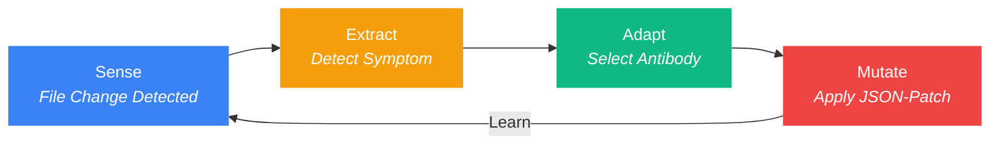

<p align="center">
  
</p>

<h3 align="center">The Autonomous Flow Daemon</h3>
<p align="center"><strong>Self-healing AI development environments in < 270ms.</strong></p>

<p align="center">
  
  
  
  
</p>

<p align="center">
  <a href="README.ko.md">한국어</a>
</p>

---

## Why afd?

> [afd] 🛡️ AI agent deleted '.claudeignore' | 🩹 Self-healed in 184ms | Context preserved.

You're deep in flow. Your AI agent makes a wrong move — deletes a config, corrupts a hook file, wipes a `.cursorrules`. Without `afd`, you stop everything, diagnose the breakage, manually fix it: **30 minutes gone**.

With `afd`, the daemon noticed in 10ms, restored the file in 184ms, and logged it silently. **You never even saw it happen.**

| Situation | Without afd | With afd |
|:----------|:------------|:---------|
| AI deletes `.claudeignore` | 30 min manual fix | **0.2s auto-heal** |
| Hook file corrupted | Re-inject hooks, restart session | **Silent background repair** |
| `git checkout` triggers 50 file events | AI goes haywire | **Mass-event suppressor kicks in** |
| New team member, missing context | Tribal knowledge required | **`afd sync` vaccines the setup** |

---

## The One-Command Experience

> **Zero-Config. Total Protection.**

```bash
npx @dotoricode/afd start
```

Or install locally:

```bash
bun link && afd start
```

That's it. One command. `afd` takes over from here:

- **Auto-Injection** — Installs `PreToolUse` hooks into Claude Code silently. No manual config editing.
- **Sense (Watcher)** — 10ms real-time monitoring of critical configs: `.claude/`, `CLAUDE.md`, `.cursorrules`.
- **Auto-Heal** — Silent background repair of missing or corrupted files using the **S.E.A.M cycle**. You won't even notice it happened.

```
$ afd start
  afd daemon started (pid 4812, port 52413)
  Hook injected into .claude/hooks.json
  Watching: .claude/, CLAUDE.md, .cursorrules
  Ready.
```

> You type `afd start`. Then you forget about it. That's the entire UX.

---

## The S.E.A.M Cycle

The intelligence inside `afd`. Every file event flows through four stages:



| Stage | What Happens | Speed |
|:------|:-------------|:------|
| **Sense** | Chokidar watcher detects `add`, `change`, `unlink` events | < 10ms |
| **Extract** | Immune engine runs 3 built-in health checks (IMM-001..003) | < 5ms |
| **Adapt** | Matches symptom to stored antibody in SQLite (WAL mode) | < 1ms |
| **Mutate** | Applies RFC 6902 JSON-Patch to restore the file | < 25ms |

> Full cycle: **< 270ms** from file deletion to full recovery.

---

## The Magic 5 Commands

Everything you need. Nothing you don't.

| Command | Essence | Intelligence Inside |
|:--------|:--------|:--------------------|
| `afd start` | **Ignite** | Daemon spawn + Hook injection |
| `afd fix` | **Diagnose** | Symptom detection & Antibody learning |
| `afd score` | **Vitals** | Health dashboard & Auto-heal stats |
| `afd sync` | **Federate** | Vaccine payload export for cross-project immunity |
| `afd stop` | **Quarantine** | Graceful shutdown & cleanup |

### Quick Reference

```bash
afd start      # Start daemon, inject hooks, begin watching
afd fix        # Scan for issues, auto-patch, learn antibodies
afd score      # Full diagnostic dashboard
afd sync       # Export antibodies to .afd/global-vaccine-payload.json
afd stop       # Graceful shutdown
```

---

## Dashboard: `afd score`

```
┌──────────────────────────────────────────────┐
│  afd score — Daemon Diagnostics              │
├──────────────────────────────────────────────┤
│  Ecosystem    : Claude Code                  │
├──────────────────────────────────────────────┤
│  Uptime       : 1h 23m                       │
│  Events       : 156                          │
│  Files Found  : 8                            │
├──────────────────────────────────────────────┤
│  Immune System                               │
│  ──────────────────────────────              │
│  Antibodies   : 7                            │
│  Level        : Fortified                    │
│  Auto-healed  : 3 background events         │
│  Last heal    : IMM-003 (12m ago)            │
├──────────────────────────────────────────────┤
│  Suppression Safety                          │
│  ──────────────────────────────              │
│  Mass events skipped  : 2                    │
│  Dormant transitions  : 0                    │
│  Active first-taps    : 1                    │
├──────────────────────────────────────────────┤
│  Hologram Budget : 84% token savings         │
└──────────────────────────────────────────────┘
```

---

## Advanced Intelligence

### Double-Tap Heuristic (Immune Tolerance)

`afd` distinguishes **accidents** from **intent**:

```
$ rm .claudeignore            # First tap → afd heals it silently
$ rm .claudeignore            # Second tap within 60s → "You meant it."
  [afd] Antibody IMM-001 set to dormant. Delete honored.
```

| Scenario | Response |
|:---------|:---------|
| Single delete (accident) | Auto-heal + record first tap |
| Re-delete within 60s (intent) | Antibody goes dormant, deletion respected |
| Re-delete after 60s | Fresh first tap, heals again |
| 3+ deletes in 1s (git checkout) | Mass-event detected, all suppression paused |

### Vaccine Network (Team Federation)

Export learned antibodies for your entire team:

```bash
afd sync
# → .afd/global-vaccine-payload.json
```

The payload is sanitized (no absolute paths, no secrets) and portable. Drop it into any project, and `afd` inherits the immunity.

### Hologram Extraction

When AI agents request file context, `afd` serves **token-efficient skeletons** — stripping comments and function bodies while preserving the full type signature:

```
Original:  2,450 chars → Hologram: 380 chars (84% savings)
```

This keeps your AI agent's context window lean without losing structural understanding.

---

## Status Line

Real-time daemon status in Claude Code's status bar:

```
🛡️ afd: OFF                              # Daemon not running
🛡️ afd: ON                               # Running, no heals
🛡️ afd: ON 🩹1                            # 1 auto-heal event
🛡️ afd: ON | 🩹 3 Healed | last: IMM-003  # Detailed view
```

---

## Plugin / MCP Setup

`afd` can be registered as a **Model Context Protocol (MCP) server** inside Claude Code, allowing the daemon to start automatically when Claude Code launches.

### Automatic (recommended)

Add to your Claude Code MCP config (`~/.claude/mcp.json` or project-level `.mcp.json`):

```json
{
  "mcpServers": {
    "afd": {
      "command": "bun",
      "args": ["run", "src/cli.ts", "start"]
    }
  }
}
```

Or copy the included manifest directly:

```bash
cp mcp-config.json .mcp.json
```

### Manual

```bash
afd start   # starts daemon in background, injects hooks
```

Once registered, Claude Code will display the live status line:

```
🛡️ afd: ON | 🩹 3 Healed | last: IMM-003
```

---

## Tech Stack

| Layer | Technology | Why |
|:------|:-----------|:----|
| Runtime | **Bun** | Native TypeScript, fast SQLite, single binary |
| Database | **Bun SQLite (WAL)** | 0.29ms reads, 24ms writes, crash-safe |
| Watching | **Chokidar** | Cross-platform, battle-tested file watcher |
| Patching | **RFC 6902 JSON-Patch** | Deterministic, composable file mutations |
| CLI | **Commander.js** | Standard, zero-surprise command parsing |

---

## Installation

```bash
# With Bun (recommended)
bun install
bun link
afd start

# With npx (no install)
npx @dotoricode/afd start
```

### Requirements

- **Bun** >= 1.0
- **OS**: Windows, macOS, Linux
- **Target**: Claude Code, Cursor (ecosystem auto-detected)

---

## License

MIT

