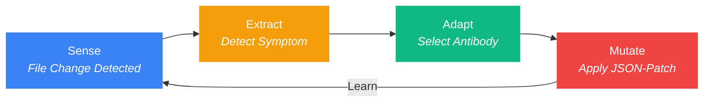

<p align="center">
  
</p>

<h3 align="center">The Invisible Guardian for AI Agents</h3>
<p align="center"><strong>Self-healing environments + 94% token savings. Your AI breaks things — afd fixes them in 184ms.</strong></p>

<p align="center">
  <a href="https://github.com/dotoricode/autonomous-flow-daemon">
    
  </a>
</p>

<p align="center">
  
  <a href="https://www.npmjs.com/package/autonomous-flow-daemon"></a>
  
  
  
</p>

<p align="center">
  <a href="README-ko.md">한국어</a>
</p>

---

## The Numbers Don't Lie

| Situation | Without afd | With afd |
|:----------|:------------|:---------|
| AI deletes `.claudeignore` | **30 min** manual fix | **0.2s** auto-heal |
| Hook file corrupted | Re-inject hooks, restart session | **Silent background repair** |
| `git checkout` triggers 50 events | AI goes haywire | **Mass-event suppressor** |
| AI reads 8 large files (114KB) | **~28,600 tokens** consumed | **~1,700 tokens** (94% saved) |
| Session token budget | Burns through context window | **26,900 tokens saved per batch** |

> `< 0.1% CPU` | `~40MB RAM` | `< 270ms` full heal cycle | You never even see it happen.

---

## One Command to Rule Them All

```bash
npx @dotoricode/afd start
```

That's it. Daemon spawns, hooks inject, MCP registers. You're protected.

```
$ afd start
  Daemon started (pid 4812, port 52413)
  Smart Discovery: Watching 7 AI-context targets
  Hook injected into .claude/hooks.json
```

---

## The Problem

Your AI agent is powerful but clumsy. It deletes `.claudeignore`, corrupts `hooks.json`, wipes `.cursorrules` — and you don't notice until everything is broken. You stop coding, diagnose the mess, manually restore files. **30 minutes gone. Flow destroyed.**

And every time it reads your codebase? Full source files pumped straight into the context window. **Thousands of tokens burned on function bodies it never needed.**

## The Solution

`afd` runs as an invisible background daemon. It watches your critical files, heals corruption in 184ms, and serves AI agents compressed type skeletons instead of raw source code. Your AI gets the structure it needs at 1/16th the token cost. Accidents get fixed before you notice. Intentional deletions are respected. Zero config, zero interference.

---

## What's New in v1.6.0

| Feature | What Changed |
|:--------|:-------------|
| **Tree-sitter AST Engine** | Replaced TypeScript compiler with tree-sitter — multilingual hologram support (TS/JS full, Python/Go/Rust fallback) |
| **Real-time HUD ROI** | Status bar now shows live session token savings as you work |
| **Event Batching** | 300ms debounce + dedup — no more event storms from rapid file changes |
| **Hook Manager** | Multi-owner orchestration — afd coexists cleanly with other hook providers |

---

## Key Features

| Feature | What it does |
|:--------|:-------------|
| **S.E.A.M Auto-Heal** | File deletion/corruption detected and restored in < 270ms |
| **Hologram Extraction** | 80-94% lighter file skeletons served to AI agents via MCP |
| **Smart Reader** | `afd_read` — small files raw, large files auto-compressed, line-range support |
| **Workspace Map** | `afd://workspace-map` — full file tree + export signatures in one call |
| **Import-Aware L1** | Only imported symbols get full signatures (85%+ savings) |
| **Double-Tap** | Delete once = heal; delete again within 30s = respected as intent |
| **Vaccine Network** | `afd sync` exports learned antibodies across projects |
| **Self-Evolution** | Quarantined failures become prevention rules automatically |
| **Mistake History** | PreToolUse hook injects past mistakes as warnings before edits |
| **HUD Counter** | Status bar shows defense count + token savings at a glance |

---

## Token Savings — Real Measured Data

The hologram system is afd's biggest value driver. Here's what we measured in a real session:

### Session Snapshot

| Metric | Value |
|:-------|:------|
| Hologram requests | 8 calls |
| Target files total size | ~114.5 KB (8 files, avg 14.3 KB each) |
| Original token cost | ~28,600 tokens |
| After hologram compression | ~1,700 tokens |
| **Tokens saved** | **~26,900 tokens (94% reduction)** |

### How It Scales

```
Session tokens (at ctx ~15%):  ~150,000  ████████████████
Tokens saved by hologram:       ~26,900  ██░░░░░░░░░░░░░░  (18% of session)
```

At ctx 50%+, file reads dominate the token budget. Without hologram, reading 8 large files costs ~28.6K tokens each time. With hologram, **each file costs 1/16th** of its original footprint — and the gap widens with every repeated read.

### Three Layers of Token Optimization

| Layer | Tool | Savings | How |
|:------|:-----|:--------|:----|
| **L0 Hologram** | `afd_hologram` | 80%+ | Strip function bodies, keep type signatures |
| **L1 Hologram** | `afd_hologram` + `contextFile` | 85%+ | Filter to only imported symbols |
| **Smart Reader** | `afd_read` | Auto | Files < 10KB raw, >= 10KB auto-hologram |
| **Workspace Map** | `afd://workspace-map` | N/A | Entire project structure in one call |

---

<details>
<summary><b>How S.E.A.M Works (internals)</b></summary>

Every file event flows through four stages:



| Stage | What Happens | Speed |
|:------|:-------------|:------|
| **Sense** | Chokidar watcher detects `add`, `change`, `unlink` events | < 10ms |
| **Extract** | Generates hologram (type skeleton) & runs health checks | < 5ms |
| **Adapt** | Matches symptom to antibody, quarantines corrupted state | < 1ms |
| **Mutate** | Applies RFC 6902 JSON-Patch to restore the file | < 25ms |

> Full cycle: **< 270ms** from file deletion to full recovery.

</details>

---

## Commands

| Command | What it does |
|:--------|:-------------|
| `afd start` | Daemon spawn + Smart Discovery + Hook injection + MCP registration |
| `afd stop` | Shift summary report & graceful shutdown (`--clean` to remove hooks & MCP) |
| `afd score` | Health dashboard with evolution & hologram metrics |
| `afd fix` | Symptom detection with hologram context & antibody learning |
| `afd sync` | Vaccine payload export/import (`--push`, `--pull`, `--remote <url>`) |
| `afd restart` | Stop + start in one command |
| `afd status` | Quick health check — daemon, hooks, MCP, defenses |
| `afd doctor` | Comprehensive health analysis with auto-fix recommendations |
| `afd evolution` | Analyze quarantined failures & generate prevention rules |
| `afd mcp install` | Register afd as MCP server in project + global config |
| `afd vaccine` | List, search, install, publish community antibodies |
| `afd lang` | Switch display language (`afd lang ko` / `afd lang en`) |

---

<details>
<summary><b>Advanced Intelligence</b></summary>

### Double-Tap Heuristic

`afd` distinguishes **accidents** from **intent**:

```
$ rm .claudeignore            # First tap -> afd heals it silently
$ rm .claudeignore            # Second tap within 30s -> "You meant it."
  [afd] Antibody IMM-001 retired. Double-tap detected. Standing down.
```

| Scenario | Response |
|:---------|:---------|
| Single delete (accident) | Auto-heal + record first tap |
| Re-delete within 30s (intent) | Antibody goes dormant, deletion respected |
| 3+ deletes in 1s (git checkout) | Mass-event detected, all suppression paused |

### Vaccine Network

```bash
afd sync              # Export to .afd/global-vaccine-payload.json
afd sync --push       # Push vaccines to remote
afd sync --pull       # Pull vaccines from remote
```

The payload is sanitized (no absolute paths, no secrets) and portable.

### Self-Evolution

```bash
afd evolution
```

Analyzes quarantined failures and writes prevention rules to `afd-lessons.md`. AI agents read this before editing immune-critical files — turning past failures into future prevention.

</details>

---

## MCP Setup

`afd` provides four MCP tools and one resource:

| MCP Tool | Purpose |
|:---------|:--------|
| `afd_read` | Smart file reader — raw for small files, auto-hologram for large, optional line ranges |
| `afd_hologram` | Token-efficient type skeleton of any TS/JS file (80%+ savings) |
| `afd_diagnose` | Health diagnosis with symptoms and hologram context |
| `afd_score` | Runtime stats: uptime, heals, hologram savings |

| MCP Resource | Purpose |
|:-------------|:--------|
| `afd://workspace-map` | Full file tree with export signatures in one call |

```bash
afd mcp install    # Registers in .mcp.json + ~/.claude.json
```

---

<details>
<summary><b>Tech Stack</b></summary>

| Layer | Technology | Why |
|:------|:-----------|:----|
| Runtime | **Bun** | Native TypeScript, fast SQLite, single binary |
| Database | **Bun SQLite (WAL)** | 0.29ms reads, 24ms writes, crash-safe |
| Parsing | **Tree-sitter** | Multilingual AST — TS, JS, Python, Go, Rust |
| Watching | **Chokidar** | Cross-platform, battle-tested file watcher |
| Patching | **RFC 6902 JSON-Patch** | Deterministic, composable file mutations |
| CLI | **Commander.js** | Standard, zero-surprise command parsing |

</details>

---

## Installation

```bash
# Fastest (no install)
npx @dotoricode/afd start

# With Bun (recommended for development)
bun install
bun link
afd start
```

### Requirements

- **Bun** >= 1.0
- **OS**: Windows, macOS, Linux
- **Target**: Claude Code, Cursor, Windsurf, Codex (ecosystem auto-detected)

---

## License

MIT
