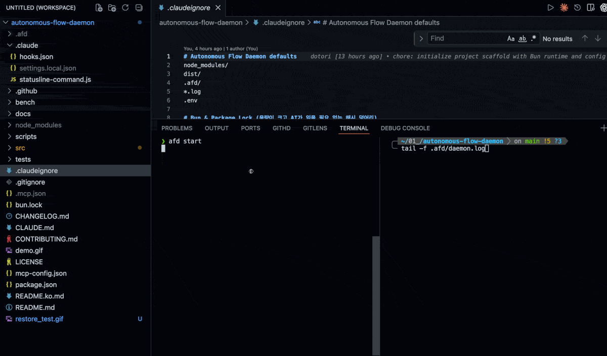
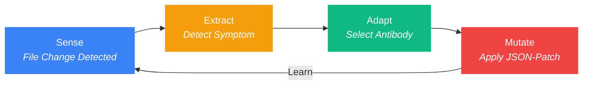

<p align="center">
  
</p>

<h3 align="center">The Autonomous Flow Daemon</h3>
<p align="center"><strong>Self-healing AI development environments in < 270ms.</strong></p>

<p align="center">
  <a href="https://github.com/dotoricode/autonomous-flow-daemon">
    
  </a>
  <br>
  <br>
  <b>🛡️ Immortal Context Flow:</b> 
  <em>"afd restores critical config files with <b>near-zero latency</b>, ensuring your AI workflow remains unbroken and cost-efficient."</em>
</p>

---

<p align="center">
  
  <a href="https://www.npmjs.com/package/autonomous-flow-daemon"></a>
  
  
  
</p>

<p align="center">
  <a href="README.ko.md">한국어</a>
</p>

---

## Why afd?

> [afd] 🛡️ AI agent deleted '.claudeignore' | 🩹 Self-healed in 184ms | Context preserved.

You're deep in flow. Your AI agent makes a wrong move — deletes a config, corrupts a hook file, wipes a `.cursorrules`. Without `afd`, you stop everything, diagnose the breakage, manually fix it: **30 minutes gone**.

With `afd`, the daemon noticed in 10ms, restored the file in 184ms, and logged it silently. **You never even saw it happen.**

| Situation | Without afd | With afd |
|:----------|:------------|:---------|
| AI deletes `.claudeignore` | 30 min manual fix | **0.2s auto-heal** |
| Hook file corrupted | Re-inject hooks, restart session | **Silent background repair** |
| `git checkout` triggers 50 file events | AI goes haywire | **Mass-event suppressor kicks in** |
| New team member, missing context | Tribal knowledge required | **`afd sync` vaccines the setup** |

---

## 🚀 Zero-Interference Promise

We built `afd` to protect your flow, not to slow it down.

* **No Performance Hit:** Running as a native background daemon via Bun, `afd` consumes **< 0.1% CPU** and **~40MB RAM**.
* **Seamless Recovery:** With **sub-millisecond healing**, files are restored before Claude Code can even register a missing context error.
* **Non-Invasive:** `afd` observes file system events from the OS layer. It never intercepts or modifies Claude Code's internal execution or API calls.

---

## ✨ Key Features (v1.3.0)

| Feature | What it does |
|:--------|:-------------|
| **🛡️ S.E.A.M Auto-Heal** | Detects file deletion/corruption and restores it in < 270ms — before your AI agent notices |
| **🔒 Quarantine Zone** | Backs up corrupted files to `.afd/quarantine/` before restoring, preserving evidence for analysis |
| **🧬 Self-Evolution** | Analyzes quarantined failures and writes prevention rules to `afd-lessons.md` — AI learns from its own mistakes |
| **📊 Hologram Extraction** | Serves 80%+ lighter file skeletons to AI agents via MCP (`afd_hologram`), slashing token costs |
| **🔌 MCP Integration** | `afd mcp install` auto-registers the daemon as an MCP server — AI agents call `afd_hologram`, `afd_diagnose`, `afd_score` autonomously |
| **📺 Live Dashboard** | `afd watch` — real-time TUI with SSE event stream, evolution stats, and heal metrics |
| **🔍 Smart Discovery** | Automatically scans for AI-context files (`.claude/`, `.cursorrules`, `.mcp.json`, etc.) — zero config required |
| **🧬 Double-Tap Heuristic** | Distinguishes accidents from intent — delete once, afd heals it; delete again within 30s, afd respects your decision |
| **💉 Vaccine Network** | Export learned antibodies via `afd sync` for cross-project, cross-team immunity |
| **🌐 Auto-Localization** | Seamlessly switches between Korean and English based on your system locale |

---

## The One-Command Experience

> **Zero-Config. Total Protection.**

```bash
npx @dotoricode/afd start
```

Or install locally:

```bash
bun link && afd start
```

That's it. One command. `afd` takes over from here:

- **Auto-Injection** — Installs `PreToolUse` hooks into Claude Code silently. No manual config editing.
- **Sense (Watcher)** — 10ms real-time monitoring of critical configs: `.claude/`, `CLAUDE.md`, `.cursorrules`, `.claudeignore`, `.gitignore`.
- **Auto-Heal** — Silent background repair of missing or corrupted files using the **S.E.A.M cycle**. You won't even notice it happened.

```
$ afd start
  🛡️ Daemon started (pid 4812, port 52413)
  🛡️ Smart Discovery: Watching 7 AI-context targets
  Targets: .claude/, CLAUDE.md, .cursorrules, .claudeignore, .gitignore, mcp-config.json, .mcp.json
  Hook injected into .claude/hooks.json
```

> You type `afd start`. Then you forget about it. That's the entire UX.

---

## The S.E.A.M Cycle

The intelligence inside `afd`. Every file event flows through four stages:



| Stage | What Happens | Speed |
|:------|:-------------|:------|
| **Sense** | Chokidar watcher detects `add`, `change`, `unlink` events | < 10ms |
| **Extract** | Generates hologram (type skeleton) for AI context & runs health checks | < 5ms |
| **Adapt** | Matches symptom to antibody, quarantines corrupted state, selects fix | < 1ms |
| **Mutate** | Applies RFC 6902 JSON-Patch to restore the file | < 25ms |

> Full cycle: **< 270ms** from file deletion to full recovery.

### Watch Targets

These files are monitored in real-time. Immune files (IMM-*) are automatically restored on deletion:

| Target | Type | Antibody | Auto-Restore |
|:-------|:-----|:---------|:-------------|
| `.claude/` | Directory | IMM-002 (`hooks.json`) | ✅ |
| `CLAUDE.md` | File | IMM-003 | ✅ |
| `.claudeignore` | File | IMM-001 | ✅ |
| `.cursorrules` | File | — | Event logging only |
| `.gitignore` | File | — | Event logging only |
| `mcp-config.json` | File | — | 🔍 Smart Discovery |
| `.mcp.json` | File | — | 🔍 Smart Discovery |
| `.ai/` | Directory | — | 🔍 Smart Discovery |
| `.windsurfrules` | File | — | 🔍 Smart Discovery |

> Antibodies are **auto-seeded on startup** with each file's current content, and **refreshed on every change** — so restores always reflect the latest version.
>
> 🔍 **Smart Discovery** scans for 12+ known AI-config patterns at startup (< 0.1ms) and adds any found files to the active watch list automatically.

---

## Commands

Everything you need. Nothing you don't.

| Command | Essence | Intelligence Inside |
|:--------|:--------|:--------------------|
| `afd start` | **Ignite** | Daemon spawn + Smart Discovery + Hook injection + MCP registration |
| `afd stop` | **Shutdown** | Shift summary report & Graceful shutdown |
| `afd score` | **Vitals** | Localized health dashboard with evolution & hologram metrics |
| `afd fix` | **Diagnose** | Symptom detection with hologram context & Antibody learning |
| `afd sync` | **Federate** | Vaccine payload export for cross-project immunity |
| `afd watch` | **Monitor** | Real-time TUI dashboard — live S.E.A.M event stream |
| `afd doctor` | **Deep Scan** | Comprehensive health analysis with auto-fix recommendations |
| `afd evolution` | **Learn** | Analyze quarantined failures & generate prevention rules |
| `afd mcp install` | **Wire** | Register afd as MCP server in project + global config |
| `afd diagnose` | **Headless** | Machine-readable diagnosis (used by auto-heal hooks) |
| `afd vaccine` | **Registry** | List, search, install, publish community antibodies |
| `afd lang` | **Localize** | Switch display language (`afd lang ko` / `afd lang en`) |

### Quick Reference

```bash
afd start          # Start daemon, inject hooks, begin watching
afd stop           # Shift summary + graceful shutdown
afd score          # Full diagnostic dashboard (localized)
afd fix            # Scan for issues, auto-patch, learn antibodies
afd sync           # Export antibodies to .afd/global-vaccine-payload.json
afd watch          # Real-time TUI dashboard with live events
afd doctor --fix   # Deep analysis + auto-fix
afd evolution      # Analyze quarantined failures, write lessons
afd mcp install    # Register MCP server for AI agent integration
afd lang ko        # Switch to Korean / afd lang en for English
```

---

## Dashboard: `afd score`

```
┌──────────────────────────────────────────────┐
│  afd score — Daemon Diagnostics              │
├──────────────────────────────────────────────┤
│  Ecosystem    : Claude Code                  │
├──────────────────────────────────────────────┤
│  Uptime       : 1h 23m                       │
│  Events       : 156                          │
│  Files Found  : 8                            │
├──────────────────────────────────────────────┤
│  Immune System                               │
│  ──────────────────────────────              │
│  Antibodies   : 7                            │
│  Level        : Fortified                    │
│  Auto-healed  : 3 background events          │
├──────────────────────────────────────────────┤
│  📈 Value Delivered                          │
│  ──────────────────────────────              │
│  Tokens saved : ~2.9K                        │
│  Time saved   : ~40 min                      │
│  Cost saved   : ~$0.01                       │
├──────────────────────────────────────────────┤
│  🗣️ The immune system holds. Another day,   │
│     another heal. 💪                         │
└──────────────────────────────────────────────┘
```

> The dashboard is fully localized. Run `afd lang ko` and every label switches to Korean.

---

## Advanced Intelligence

### Double-Tap Heuristic (Immune Tolerance)

`afd` distinguishes **accidents** from **intent**:

```
$ rm .claudeignore            # First tap → afd heals it silently
$ rm .claudeignore            # Second tap within 30s → "You meant it."
  [afd] 🫡 Antibody IMM-001 retired. Double-tap detected. Standing down.
```

| Scenario | Response |
|:---------|:---------|
| Single delete (accident) | Auto-heal + record first tap |
| Re-delete within 30s (intent) | Antibody goes dormant, deletion respected |
| Re-delete after 30s | Fresh first tap, heals again |
| 3+ deletes in 1s (git checkout) | Mass-event detected, all suppression paused |

### Vaccine Network (Team Federation)

Export learned antibodies for your entire team:

```bash
afd sync
# → .afd/global-vaccine-payload.json
```

The payload is sanitized (no absolute paths, no secrets) and portable. Drop it into any project, and `afd` inherits the immunity.

### Quarantine Zone (Forensic Backup)

Before restoring a corrupted or deleted file, `afd` saves the damaged version to `.afd/quarantine/`:

```
.afd/quarantine/
  20260401_021028_.claude_hooks.json        # Corrupted JSON (missing brace)
  20260401_022040_.claudeignore.learned     # Deletion event (already analyzed)
```

This preserves evidence for post-mortem analysis — and powers the Self-Evolution engine.

### Self-Evolution (AI Learns From Mistakes)

```bash
afd evolution
```

Analyzes quarantined failures, diffs them against restored originals, and writes prevention rules to `afd-lessons.md`:

```markdown
### .claude/hooks.json (2026-04-01 02:10:28)
- **Type**: Content Corruption
- **Rule**: When editing `.claude/hooks.json`, ensure valid JSON syntax.
  Common mistake: Expected '}'. Always validate JSON structure after editing.
```

AI agents read `afd-lessons.md` before editing immune-critical files — turning past failures into future prevention.

### Hologram Extraction (MCP-Powered)

When AI agents need file context, `afd` serves **token-efficient skeletons** via the `afd_hologram` MCP tool:

```
Original:  8,425 chars → Hologram: 1,193 chars (85.8% savings)
```

The hologram preserves imports, interfaces, type signatures, and function signatures while stripping all implementation details. AI agents call this automatically before reading large files.

---

## Status Line

Real-time daemon status in Claude Code's status bar:

```
🛡️ afd: OFF                              # Daemon not running
🛡️ afd: ON                               # Running, no heals
🛡️ afd: ON 🩹1                            # 1 auto-heal event
🛡️ afd: ON | 🩹 3 Healed | last: IMM-003  # Detailed view
```

---

## Plugin / MCP Setup

`afd` provides three MCP tools that AI agents can call autonomously:

| MCP Tool | Purpose |
|:---------|:--------|
| `afd_hologram` | Get token-efficient type skeleton of any TS/JS file (80%+ savings) |
| `afd_diagnose` | Run health diagnosis and get symptoms with hologram context |
| `afd_score` | Get daemon runtime stats: uptime, heals, hologram savings |

### One-Command Setup (recommended)

```bash
afd mcp install
```

This registers the MCP server in both `.mcp.json` (project) and `~/.claude.json` (global). Restart Claude Code to activate.

### Manual Config

Add to your Claude Code MCP config (`.mcp.json`):

```json
{
  "mcpServers": {
    "afd": {
      "command": "bun",
      "args": ["run", "src/daemon/server.ts", "--mcp"]
    }
  }
}
```

Once registered, AI agents automatically use `afd_hologram` to read file structures efficiently, and Claude Code's status bar shows:

```
🛡️ afd: ON | 🩹 3 Healed | last: IMM-003
```

---

## Tech Stack

| Layer | Technology | Why |
|:------|:-----------|:----|
| Runtime | **Bun** | Native TypeScript, fast SQLite, single binary |
| Database | **Bun SQLite (WAL)** | 0.29ms reads, 24ms writes, crash-safe |
| Watching | **Chokidar** | Cross-platform, battle-tested file watcher |
| Patching | **RFC 6902 JSON-Patch** | Deterministic, composable file mutations |
| CLI | **Commander.js** | Standard, zero-surprise command parsing |
| i18n | **Built-in engine** | Zero-dependency locale switching in 0.01ms |

---

## Installation

```bash
# With Bun (recommended)
bun install
bun link
afd start

# With npx (no install)
npx @dotoricode/afd start
```

### Requirements

- **Bun** >= 1.0
- **OS**: Windows, macOS, Linux
- **Target**: Claude Code, Cursor, Windsurf, Codex (ecosystem auto-detected)

---

## License

MIT

